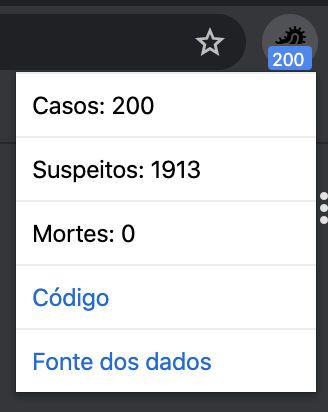

# Covid-19 Brazil Tracker

Track Covid-19 cases in Brazil from Chrome extensions

## Example

## Data source

The project is using the [corona-analytic-api](https://github.com/rodrilima/corona-analytic-api#its-trustable).

## Installing

- [Download](https://github.com/emersonlaurentino/covid-19braziltracker/archive/master.zip) our source code
- Unzip the downloaded folder
- In Chrome, access the [Extensions](chrome://extensions) page and toggle **Developer Mode** on
- Click on the button **Load unpacked** and select the unzipped folder
